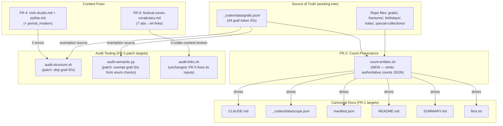

# SDD: Codex Reality Reconciliation & Hygiene

**Version:** 1.0
**Date:** 2026-05-29
**Author:** Architecture Designer Agent (/architect)
**Status:** Draft
**Cycle:** 025
**PRD Reference:** `grimoires/loa/prd.md`
**Discovery method:** /architect — codebase-grounded against live audit reports + repo inspection (2026-05-29). Every count and claim below was re-verified against the working tree, not copied from the PRD.

---

## 0. Reality Check (read this first)

This is a **hygiene / data-reconciliation cycle for a markdown knowledge base**, not a software product. There is no application architecture, no database, no UI, no API. The "system" being designed is a set of **deterministic edits + two script patches + one provenance step** that bring canonical docs into agreement with the repository and make the audit tooling tell the truth.

The PRD is sound on intent. While grounding this SDD I **re-derived every count from the working tree** and found that **several numbers in the PRD itself are stale** — the same drift the cycle exists to kill. The SDD treats *computed reality* (commands below) as the single source of truth and corrects the PRD's figures where they disagree. These corrections are flagged in §3.1 and must be confirmed before FR-1 edits land.

### Verified-reality table (computed 2026-05-29, working tree)

| Entity | scope.json | CLAUDE.md scope §52 | CLAUDE.md dir-table | **Computed reality** | Reconciliation target |
|--------|-----------:|--------------------:|--------------------:|---------------------:|-----------------------|
| Grails | 44 | 44 | **43** | **44** files in `grails/` (excl README); 44 IDs in `grails.jsonl` | **44** everywhere (fix dir-table 43→44) |
| Fractures | 10 | **11** | 11 | **10** entity files in `fractures/` (`miladies`, `miparcels`, 8×`mireveal-*`) | **10** everywhere (fix CLAUDE.md 11→10) |
| Birthday eras | 10 | 10 | 10 | **12** `.md` files / **10** eras (`README.md` + `timeline.md` are non-era) | **10 eras (12 files: 10 eras + README + timeline)** |
| Traits | 1337 | 1337 | 1337 | **1326** entity files (1349 total − 22 README − 1 overview); semantic audit's own `total_traits`=**1326** | **1337 unique (1323 imaged + 14 metadata-only) / 1326 files** |
| Special collections | 33 | 33 (PARTIAL) | **32** | **53** files across **5** populated sub-collections (bera-eco 32, cypherpunk 12, milady-1-of-1s 5, bong-bears 4, singapore-jani 0) | **53 files / 5 sub-collections** + keep the "33 documented collaborations" concept distinct |
| Drugs | 78 | 78 | n/a | **78** files | **78** (verify-only — already correct) |

**Commands that produced the "Computed reality" column** (these become the FR-2 provenance script):

```bash
# Grails
ls grails/*.md | grep -vi README | wc -l                       # → 44
wc -l < _codex/data/grails.jsonl                               # → 44
# Fractures (entity files only)
ls fractures/*.md | grep -viE 'README|index' | wc -l           # → 10
# Birthdays
ls birthdays/*.md | wc -l                                      # → 12 files (10 eras + README + timeline)
# Traits (entity files)
find traits -name '*.md' ! -name README.md ! -name overview.md | wc -l   # → 1326
# Drugs
find traits/overlays/molecules -name '*.md' ! -name README.md ! -name drug-pairings.md | wc -l  # → 78
# Special collections
find special-collections -name '*.md' ! -name README.md | wc -l          # → 53
find special-collections -mindepth 1 -type d | wc -l                     # → 5
```

> **PRD deltas surfaced (must confirm before FR-1):**
> - PRD §1/FR-1 says traits = **"1,245 files"**; computed reality is **1,326** files. The semantic audit's own `total_traits` field independently reports 1326. **Use 1326.**
> - PRD FR-1 says birthdays = **"11 files"**; reality is **12** files (10 eras + `README.md` + `timeline.md`). **Use 12 files / 10 eras.**
> - PRD FR-1 says special collections = **"6 sub-collections"**; reality is **5** populated subdirs (`singapore-jani/` exists as a dir but holds 0 `.md`). **Use 5** (or "6 dirs incl. empty `singapore-jani/`" if the empty dir is intentional — Open Question Q1).

---

## 1. Project Architecture

### 1.1 System Overview

The Mibera Codex is a 21,773-file markdown knowledge base. Its self-describing documents (`CLAUDE.md`, `scope.json`, `manifest.json`, `README.md`, `SUMMARY.md`, `llms.txt`) and its three audit scripts (`audit-structure.sh`, `audit-semantic.py`, `audit-links.sh`) have drifted from the repository's actual contents. This cycle makes the docs match reality and makes the audits report only genuine issues.

> From prd.md §1: *"The Mibera Codex's canonical documentation has drifted from the repository's actual state, and its audit tooling reports a large but mostly-false error count that hides the genuine issues."*

### 1.2 Architectural Pattern

**Pattern:** Edit-in-place reconciliation with a generated-provenance backstop.

**Justification:** There is no system to architect — there is a corpus to correct. The only durable structural change is FR-2: a **single computed-counts artifact** that future doc updates cite, so the hand-maintained-number drift that caused this cycle cannot silently recur. Everything else is a bounded set of surgical edits whose correctness is verified by re-running the existing audit suite to specific target numbers.

### 1.3 Component Diagram



### 1.4 System Components

#### Canonical docs (FR-1)
- **Purpose:** Human/LLM-facing descriptions of the codex. **Drift symptom:** contradictory entity counts. **Change:** every count updated to computed reality, conceptual-vs-file distinctions stated explicitly.

#### Audit scripts (FR-3)
- **Purpose:** Validate structural + semantic integrity. **Drift symptom:** 1,144 false-positive structural errors + 4 false-positive semantic FAILs, all from the 44 grail 1/1s (which correctly have no generative traits). **Change:** load grail IDs from `grails.jsonl`, skip generative-trait checks for them.

#### Content fixes (FR-4, FR-5)
- **Purpose:** Two genuine ancestor schema gaps + codex-content broken links. **Change:** add `period_modern` to 2 ancestor files; repoint 7 absolute-path links to relative.

#### Count provenance (FR-2)
- **Purpose:** Make counts script-derived, not eyeballed, so drift can't recur.

> **Source:** prd.md §5 (FR-1 through FR-6), §1 (audit findings).

---

## 2. Software Stack

| Concern | Choice | Justification |
|---------|--------|---------------|
| Doc edits | Hand edits via Edit tool | Surgical, reviewable, no codegen risk on prose. |
| FR-2 provenance | **bash** (`count-entities.sh`), stdlib only | `CLAUDE.md` Script Conventions: shell scripts use bash, macOS/BSD tooling. Counts are `find`/`wc`/`ls` — no Python needed. Emits JSON via printf. |
| FR-3 structure patch | **bash** edit to `audit-structure.sh` | Existing script is bash; patch stays in-language. Read grail IDs once into an associative-array/grep filter. |
| FR-3 semantic patch | **Python 3 + PyYAML** edit to `audit-semantic.py` | Existing script is Python; it already imports `json`, loads `grails.jsonl` is one `open()` + per-line `json.loads`. PyYAML permitted per `CLAUDE.md`. |
| FR-6 orphan findings | **Markdown findings doc** | No code — documentation deliverable. |
| Verification | Existing audit trio | `bash audit-structure.sh`, `bash audit-links.sh`, `python3 audit-semantic.py`. |

**Exact tool versions present (verified):**
- `bash` (macOS BSD) — scripts already target this; `grep -rL` and `awk` frontmatter extraction are in use.
- `python3` with `yaml` (PyYAML) — `audit-semantic.py:13 import yaml` already relies on it.

**Portability constraints (from NOTES.md, load-bearing):**
- macOS BSD `awk` has no capture groups in `match()` — use python3 for regex.
- macOS `grep` has no `-oP` — use python3 or sed for portable regex.
- Bulk text replacements can hit image filenames / trait item names — **scope every replacement** (see §6).

> **Source:** CLAUDE.md "Script Conventions"; NOTES.md:8–9; existing script shebangs.

---

## 3. Data Models

There is no database. The "data model" here is the **count contract** (FR-2 output) and the **grail-exemption set** (FR-3 input).

### 3.1 Count provenance artifact (FR-2 — NEW)

`count-entities.sh` emits an authoritative counts JSON that FR-1 edits cite.

```json
{
  "generated": "2026-05-29T00:00:00Z",
  "counts": {
    "mibera":            { "files": 10000, "concept": 10000 },
    "miparcel":          { "files": 10000, "concept": 10000 },
    "grail":             { "files": 44,    "concept": 44, "note": "42 canonical + 2 community" },
    "fracture":          { "files": 10,    "concept": 10 },
    "birthday":          { "files": 12,    "eras": 10, "note": "10 eras + README + timeline" },
    "trait":             { "files": 1326,  "concept": 1337, "note": "1337 unique = 1323 imaged + 14 metadata-only" },
    "drug":              { "files": 78,    "concept": 78 },
    "tarot_card":        { "files": 78,    "concept": 78 },
    "ancestor":          { "files": 33,    "concept": 33 },
    "special_collection":{ "files": 53,    "subcollections": 5, "concept": 33, "note": "53 files / 5 populated subdirs; 33 = documented collaborations" },
    "mibera_set":        { "files": 12,    "concept": 12 }
  }
}
```

**The `files` vs `concept` split is the whole point.** Every doc count must state which it means. The cycle's chronic bug is conflating "files on disk" with "conceptual entities counted."

**Output path:** `_codex/data/entity-counts.json` (sits beside `scope.json`).

> **Source:** prd.md FR-2; §0 computed-reality table; scope.json field shapes.

### 3.2 Grail-exemption set (FR-3 — INPUT, already exists)

```python
# Source: _codex/data/grails.jsonl — 44 lines, each: {"id": <int>, "name", "slug", ...}
GRAIL_IDS = { json.loads(line)["id"] for line in open(grails_jsonl) }   # → {235, 309, 392, 507, 876, ...} (44 IDs)
```

**Verified invariant (must hold or FR-3 fails loud):** the set of grail IDs in `grails.jsonl` is **exactly** the set of 44 Mibera files lacking a generative trait table.

```
grail_ids (from grails.jsonl)  ==  miberas missing "| Archetype |" table row    → TRUE (verified 2026-05-29)
|grail_ids| = 44 ,  |missing| = 44 ,  symmetric difference = ∅
```

If `grails.jsonl` is absent or the set-equality breaks at audit time, the patch must **exit non-zero with a clear message** (do not silently skip exemption — that would re-mask real errors). This is the FR-3 fail-loud requirement.

> **Source:** prd.md FR-3, Appendix B; verified by set-equality on the working tree (2026-05-29).

### 3.3 Ancestor schema gap (FR-4 — content fix)

`audit-structure.sh:181` requires ancestor frontmatter fields: `name`, `period_ancient`, `period_modern`, `locations`. Two files are missing `period_modern`:

| File | Has | Missing |
|------|-----|---------|
| `core-lore/ancestors/irish-druids.md` | `name`, `period_ancient: -500 - 500`, `locations` | **`period_modern`** |
| `core-lore/ancestors/pythia.md` | `name`, `period_ancient: -800 - 395`, `locations` | **`period_modern`** |

The added value must be consistent with each entry's content and the ancestor schema (a string, e.g. a modern-revival span or `null` if genuinely none — but the field key must be present, since the audit checks key presence, not value).

> **Source:** prd.md FR-4; audit-structure.sh:181; verified file inspection.

---

## 4. UI Design

**N/A.** No UI in scope. The codex docs site (`docs/`, cycle-024) is explicitly out of scope; this cycle touches only repo-root canonical docs, `_codex/`, and codex content.

---

## 5. API Specifications

**N/A.** No API. The "interface contract" is the **audit exit codes**, documented here because CI relies on them:

| Script | Success contract (post-cycle) | Failure semantics |
|--------|-------------------------------|-------------------|
| `audit-structure.sh` | exit 0, `errors: 0` | exit 1 if any `severity:error` (line 243) |
| `audit-semantic.py` | exit 0, `fail: 0` for archetype/element/drug/ancestor | exit 1 if `fail_count > 0` (line 340) |
| `audit-links.sh` | 0 **codex-content** broken links (3 framework links remain, out of scope) | reports count; see §9 risk on whether it exits non-zero |

**Grail-exemption interface (FR-3) — both scripts:**
- Input: `_codex/data/grails.jsonl`, field `id` (int).
- Behavior: a Mibera whose numeric ID ∈ `GRAIL_IDS` is **skipped** for generative-trait checks (structure: the `MIBERA_FIELDS` trait-row grep loop; semantic: `check_archetype_enum`, `check_element_enum`, `check_drug_references`, `check_ancestor_references`).
- Fail-loud: if `grails.jsonl` missing/unreadable → script errors out, does not run with empty exemption.

> **Source:** prd.md FR-3; audit-structure.sh:33–61, 243–245; audit-semantic.py:105–187, 340–341.

---

## 6. Error Handling Strategy

The risk in a 21,773-file edit cycle is **collateral damage from bulk replacement** and **breaking the things that already work** (10K Miberas, backlink sections). Strategy:

### 6.1 Scoped, surgical edits (NEVER bulk-substitute counts)

> From NOTES.md:10: *"Bulk text replacements on drug names can accidentally hit image filenames and trait item names — scope replacements carefully."*

- FR-1 count edits target **specific files at specific lines**, not repo-wide `sed`. The numbers (`44`, `10`, `1337`, `53`) appear in many contexts; a global replace of "43"→"44" would corrupt unrelated content. Each count edit is a unique-context Edit-tool replacement.
- Verified instances to fix in `CLAUDE.md`: line 52 (`11 Fractures`→`10`), line 80 (traits dir-table — confirm phrasing), line 85 (`43`→`44`), line 90 (`32`→reconciled special-collections statement).

### 6.2 Protected zones (NEVER touch)

| Protected | Enforcement |
|-----------|-------------|
| `@generated:backlinks` sections | No edit may fall between `<!-- @generated:backlinks-start -->` / `-end -->` markers (CLAUDE.md safety rule, prd.md §6). |
| Entity counts that are already correct | 10K Miberas / 10K MiParcels / 44 grails / 12 sets / 78 drugs / 78 tarot must remain unchanged (G5). |
| `.claude/` System Zone | Out of bounds entirely. |
| Grail trait tables | **Never** add fake trait tables to grail files (FR-3 AC). |

### 6.3 Audit-patch fail-loud

FR-3 patches must **fail loud** if `grails.jsonl` is missing or the set-equality invariant breaks (§3.2). Silent fallback to "no exemption" re-creates the 1,144-error wall; silent fallback to "exempt everything" hides real errors. Both are forbidden.

### 6.4 FR-5 link semantics

- `festival-zones-vocabulary.md` lives at `core-lore/festival-zones-vocabulary.md`. The 7 broken links are **absolute paths** (`/core-lore/...`, `/traits/...`). Fix:
  - `/core-lore/archetypes.md#anchor` → `archetypes.md#anchor` (same directory).
  - `/core-lore/ancestors/` → `ancestors/` (same directory).
  - `/traits/overlays/molecules/` → `../traits/overlays/molecules/` (one level up from `core-lore/`).
- **Anchor verification (done):** `core-lore/archetypes.md` has `## Freetekno` / `## Milady` / `## Acidhouse` / `## Chicago/Detroit`. GitHub slugs → `#freetekno`, `#milady`, `#acidhouse`, `#chicagodetroit`. All four target anchors resolve. (Risk PRD §9 line 177 — mitigated: anchors confirmed present.)

### 6.5 FR-5 grails/README.md — likely false positive (NEEDS DECISION)

The PRD (FR-5) lists "`grails/README.md`: 1 broken link." Inspection shows the flagged target is the literal ellipsis `…` inside **illustrative CDN-path table cells** (`…/grails/black-hole.webp` etc.) and prose (``). These are **documentation examples**, not real links. Options:
1. **No-op** — they're intentional examples; instead exempt `…`-targets from `audit-links.sh` or accept them as informational.
2. Reword the table to not use markdown-link-shaped `…/...` so the checker stops flagging.

**Recommendation:** Option 2 if cheap (escape/backtick the example paths so they aren't parsed as links); otherwise document as a known false positive. **This changes FR-5's "0 broken links" target** — see Open Question Q2.

> **Source:** prd.md FR-5, §6; NOTES.md:10; audit-links.json; verified link/anchor inspection.

---

## 7. Testing Strategy

Verification is **re-running the existing audit trio to exact target numbers**. There is no new test framework.

### 7.1 Acceptance gates (each FR → a command + expected output)

| FR | Verification command | Expected result |
|----|----------------------|-----------------|
| FR-3 (structure) | `bash _codex/scripts/audit-structure.sh; echo $?` | errors: **2** before FR-4, **0** after FR-4; exit 0 when 0 |
| FR-3 (semantic) | `python3 _codex/scripts/audit-semantic.py` | `archetype_enum`, `element_enum`, `drug_references`, `ancestor_references` → **PASS** (were 44-violation FAIL each) |
| FR-4 | `bash _codex/scripts/audit-structure.sh` then grep ancestor issues | ancestor issues **2 → 0** |
| FR-5 | `bash _codex/scripts/audit-links.sh` | **0** codex-content broken links (3 framework links remain, documented out-of-scope) |
| FR-1 | Manual diff of all 6 docs against `entity-counts.json` | no count contradiction; conceptual-vs-file stated |
| FR-2 | `bash _codex/scripts/count-entities.sh \| python3 -m json.tool` | valid JSON; matches §0 computed-reality table |
| FR-6 | findings doc exists | 20 orphans listed with path + reason + keep/prune rec |
| G5 (no regression) | `git diff --stat`; grep for `@generated` edits | 10K/10K/44/12/78 counts unchanged; no backlink-section edits |

### 7.2 Regression guard (the dangerous part)

The semantic audit's `orphan_traits` check must **remain `status: "info"`** (audit-semantic.py:248) — never promoted to FAIL — so FR-6's investigation doesn't turn 20 informational orphans into a red build (prd.md FR-6 AC, §8).

The 10,000 Mibera files are "100% structurally consistent — zero issues" (NOTES.md:138). After FR-3 grail exemption, the **only** structural errors should be the 2 ancestor gaps (FR-4), then zero. Any other delta in `audit-structure.json` error count is an unintended regression.

### 7.3 Before/after baseline (the success ledger)

| Metric | Before (verified 2026-05-29) | Target after |
|--------|------------------------------|--------------|
| `audit-structure.sh` errors | 1,146 (1,144 grail + 2 ancestor) | **0** |
| `audit-semantic.py` summary | 4 pass / 4 fail | **8 pass / 0 fail** (orphan stays info) |
| `audit-links.sh` broken | 11 (8 codex-content + 3 framework) | **0 codex-content** (3 framework out-of-scope; +grails/README per Q2) |
| Doc count contradictions | ≥5 | **0** |

> **Source:** prd.md §8 Success Criteria, §3 Goals; audit reports; NOTES.md:138,141,143.

---

## 8. Development Phases

Sequenced to **unblock trustworthy audits first**, then reconcile, then prevent recurrence. Mirrors prd.md §7 priority matrix.

### Phase 1 — Audit truth (P0, unblocks everything)
1. **FR-3a** Patch `audit-structure.sh`: load `GRAIL_IDS` from `grails.jsonl`; skip the trait-field grep loop (lines 33–43) for grail IDs. Fail loud if jsonl missing.
2. **FR-3b** Patch `audit-semantic.py`: add `load_grail_ids()`; exempt grail IDs in `check_archetype_enum`/`element_enum`/`drug_references`/`ancestor_references`.
3. Verify: structure 1,146 → 2 ; semantic 4 FAIL → 4 PASS.

### Phase 2 — Genuine content fixes (P0)
4. **FR-4** Add `period_modern` to `irish-druids.md` + `pythia.md`. Verify structure 2 → 0.
5. **FR-5** Repoint 7 absolute links in `festival-zones-vocabulary.md` to relative (§6.4). Resolve grails/README.md per Q2. Verify links → 0 codex-content broken.

### Phase 3 — Provenance + reconciliation (P1 → P0)
6. **FR-2** Write `count-entities.sh` → `_codex/data/entity-counts.json` (§3.1). Verify against §0 table.
7. **FR-1** Reconcile counts in `CLAUDE.md`, `scope.json`, `manifest.json`, `README.md`, `SUMMARY.md`, `llms.txt`, **driven by `entity-counts.json`** (not eyeballing). Surgical per-file edits only (§6.1).

### Phase 4 — Investigation (P1, no disposition)
8. **FR-6** Document all 20 orphan traits (§11 Appendix lists them) with path + likely reason + keep/prune rec. **No deletions.** Keep orphan check `info`.

### Phase 5 — Final gate
9. Re-run full audit trio; confirm §7.3 targets; `git diff` review for G5 no-regression.

**Suggested sprint grouping for /sprint-plan:** Sprint 1 = Phases 1–2 (audit truth + content fixes, the P0 core). Sprint 2 = Phases 3–4 (provenance + reconciliation + orphan investigation). Phase 5 is the audit gate folded into each sprint's acceptance.

> **Source:** prd.md §7 priority matrix, §5 FR dependencies.

---

## 9. Known Risks and Mitigation

| Risk | Prob | Impact | Mitigation |
|------|------|--------|------------|
| **PRD count figures are stale** (traits 1245 vs real 1326; birthdays 11 vs 12 files; special-coll 6 vs 5 subdirs) | **High (confirmed)** | High — reconciling to wrong numbers re-introduces drift | SDD §0 corrects all three to computed reality; FR-2 script makes counts script-derived; confirm §0 deltas before FR-1 edits land |
| Bulk count replacement hits unrelated content | Med | High | §6.1 surgical per-context edits, never repo-wide `sed`; `git diff` review (G5) |
| `grails.jsonl` absent / set-equality breaks at audit time | Low | High | §3.2 fail-loud; invariant verified today (44==44, symdiff ∅); wire exemption to jsonl not a hardcoded list (FR-3 AC) |
| `festival-zones` anchor links break valid anchors | Low | Low | §6.4 — all 4 archetype anchors confirmed present in `archetypes.md` before/after |
| grails/README.md "broken link" is a false positive | **High (confirmed)** | Low | §6.5 — it's an illustrative `…/…webp` example, not a real link; resolve via Q2 (reword or accept) — do **not** invent a real link to satisfy the checker |
| Editing `scope.json` `special_collection.count` 33→53 changes meaning | Med | Med | Keep BOTH: `files: 53` / `subcollections: 5` AND the conceptual `33 documented collaborations` note; don't overwrite the concept with the file count |
| Orphan check flipped to FAIL by accident | Low | Med | §7.2 — assert audit-semantic.py:248 stays `status: "info"` |
| `audit-links.sh` exit code on remaining 3 framework links blocks CI | Med | Low | 3 framework links (`PROCESS.md`×2, `INSTALLATION.md`) are out-of-scope (prd.md §7); confirm whether checker exits non-zero on them — Open Question Q3 |

### Assumptions (from PRD, carried forward)
- `[ASSUMPTION]` "Reality wins" = edit docs to match repo (except the genuine repo fixes FR-4/FR-5). — *If wrong, some "drift" is actually a missing/extra entity needing a content fix.*
- `[ASSUMPTION]` The 12th/11th birthday file and 53-vs-33 special-collections gap are **index/structure**, not missing/extra entities. — Verified: birthday extras are `README.md` + `timeline.md` (structure, confirmed); special-collections 53 are real sub-collection entries vs the "33 collaborations" concept (confirmed structure).
- `[ASSUMPTION]` `period_modern` may be `null`-valued where an ancestor has no modern revival, as long as the **key is present** (audit checks key presence). — *If the schema requires a non-null string, FR-4 needs editorial values.*

> **Source:** prd.md §9; verified against working tree.

---

## 10. Open Questions

| # | Question | Why it matters | Recommendation |
|---|----------|----------------|----------------|
| **Q1** | Is the empty `special-collections/singapore-jani/` dir intentional (placeholder for a planned collection) or stale? | Determines whether we report "5 sub-collections" or "6 dirs incl. 1 empty." | Report **5 populated**; note `singapore-jani/` as empty-placeholder in `entity-counts.json`. Confirm with stakeholder. |
| **Q2** | grails/README.md `…/…webp` flagged links — reword to un-parse, or accept as documented false positive? | Changes FR-5's "0 broken links" success target. | **Reword** (backtick/escape the example paths) if cheap; else accept + document. Do not fabricate a real link. |
| **Q3** | Does `audit-links.sh` exit non-zero on the 3 out-of-scope framework links? If so, does CI go red despite codex content being clean? | A red CI from out-of-scope links defeats G2 ("audit red == real problem"). | If it exits non-zero, add an out-of-scope allowlist for `PROCESS.md`/`INSTALLATION.md` framework refs (NOT new feature scope — a one-line skip). Confirm. |
| **Q4** | `period_modern` values for irish-druids + pythia — editorial content or `null`? | FR-4 acceptance needs "valid value consistent with the entry's content." | Author wants editorial values? Then FR-4 is editorial, not mechanical. Default: key-present with best-fit string from each entry's existing prose. |
| **Q5** | Should FR-2 `count-entities.sh` be wired into the existing audit run (so counts re-check in CI), or stand alone? | PRD FR-2 is "Should" — provenance is the anti-recurrence lever; CI wiring makes it durable. | Ship standalone first (low blast radius); propose CI wiring as a follow-up note in the cycle retrospective. |

> **Source:** prd.md §9 + SDD grounding-phase discoveries (2026-05-29).

---

## 11. Appendix

### A. The 20 orphan traits (FR-6 investigation seed)

Computed by `audit-semantic.py check_orphan_traits` (paths relative to `traits/`):

```
accessories/face-accessories/heart.md
accessories/hats/peyote.md
character-traits/eyes/crying-ocean-2.md
character-traits/eyes/ecstasy-brown-2.md
character-traits/hair/middle-orange.md
character-traits/tattoos/no-tattoos.md
clothing/long-sleeves/baby-bera-jacket.md
clothing/long-sleeves/henlo-jersey.md
clothing/long-sleeves/keith-haring-shirt.md
clothing/short-sleeves/90s-tracksuit.md
clothing/short-sleeves/blue-ribbon-tank.md
clothing/short-sleeves/cactus-shirt.md
clothing/short-sleeves/knit-sweater.md
clothing/short-sleeves/palestinians-for-black-power.md
clothing/short-sleeves/plain-air.md
clothing/short-sleeves/plain-earth.md
clothing/short-sleeves/plain-fire.md
clothing/short-sleeves/plain-water.md
clothing/short-sleeves/ribbon-lolita.md
clothing/short-sleeves/tennis-outfit.md
```

**Investigation hints (for FR-6, not decisions):**
- `crying-ocean-2.md`, `ecstasy-brown-2.md` — NOTES.md:39 records these were created as stubs in Cycle 002 ("were actually naming mismatches" / variant stubs). Likely **legit-unused variant catalog entries** → lean keep, flag as variant.
- `no-tattoos.md`, `plain-{air,earth,fire,water}.md` — "absence/plain" catalog entries that may never be referenced by name in Mibera tables → likely **legit catalog completeness** → lean keep.
- The clothing entries (`henlo-jersey`, `keith-haring-shirt`, `90s-tracksuit`, etc.) — verify whether they're rare/zero-mint traits vs erroneous duplicates before any prune recommendation.

### B. Verified key fact (FR-3 foundation)

The 44 Mibera files lacking trait tables are **exactly** the 44 grail token IDs in `_codex/data/grails.jsonl` (field `id`). Confirmed by set-equality on the working tree 2026-05-29: `|grail_ids| = 44`, `|missing_table| = 44`, symmetric difference = ∅. Sample IDs: 235, 309, 392, 507, 876.

### C. Files touched by this cycle

| File | FR | Change type |
|------|----|-------------|
| `_codex/scripts/audit-structure.sh` | FR-3a | patch (grail skip + fail-loud) |
| `_codex/scripts/audit-semantic.py` | FR-3b | patch (grail exemption in 4 checks) |
| `core-lore/ancestors/irish-druids.md` | FR-4 | add `period_modern` |
| `core-lore/ancestors/pythia.md` | FR-4 | add `period_modern` |
| `core-lore/festival-zones-vocabulary.md` | FR-5 | 7 abs→rel links |
| `grails/README.md` | FR-5 | reword example paths (per Q2) |
| `_codex/scripts/count-entities.sh` | FR-2 | NEW |
| `_codex/data/entity-counts.json` | FR-2 | NEW (generated) |
| `CLAUDE.md` | FR-1 | count reconciliation (lines 52, 80, 85, 90) |
| `_codex/data/scope.json` | FR-1 | count reconciliation (fractures, special_collection, trait notes) |
| `manifest.json` | FR-1 | count reconciliation |
| `README.md` | FR-1 | count reconciliation |
| `SUMMARY.md` | FR-1 | count reconciliation |
| `llms.txt` | FR-1 | count reconciliation |
| FR-6 findings doc (path TBD by sprint-plan) | FR-6 | NEW (orphan investigation) |

### D. Sources & Traceability

| SDD Section | Sources |
|-------------|---------|
| §0 Reality check | working-tree counts (commands shown); scope.json; CLAUDE.md:52,80,85,90; audit-semantic.json `total_traits` |
| §1 Architecture | prd.md §1, §5 |
| §2 Stack | CLAUDE.md Script Conventions; NOTES.md:8–9; script shebangs |
| §3 Data models | prd.md FR-2/FR-3/FR-4; grails.jsonl; audit-structure.sh:181; set-equality verification |
| §5 Interfaces | audit-structure.sh:33–61,243–245; audit-semantic.py:105–187,340–341 |
| §6 Error handling | NOTES.md:10; CLAUDE.md safety rules; audit-links.json; anchor inspection |
| §7 Testing | prd.md §8; audit reports; NOTES.md:138,141,143 |
| §8 Phases | prd.md §7 |
| §9 Risks | prd.md §9 + grounding discoveries |
| §10 Open questions | prd.md §9 + grounding discoveries |
| §11 Appendix | audit-semantic.json orphan list; NOTES.md:39; grails.jsonl |

---

*Authoring: /architect (designing-architecture skill), cycle-025. Codebase-grounded; every count re-verified against the working tree 2026-05-29. PRD count figures corrected where stale — see §0.*
